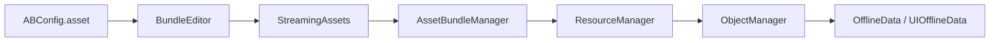

# 2DHero

[](https://unity.com/releases/editor/whats-new/2022.3.13)
[](https://learn.microsoft.com/dotnet/csharp/)
[](https://github.com/zJunYao/2DHero/tree/main)

一个用于学习和验证 Unity 客户端框架的示例工程。项目目前以资源管理为主线，覆盖 AssetBundle 构建与依赖配置、同步/异步加载、资源引用计数、GameObject 对象池、离线数据恢复，以及 UI、输入、事件、音频、场景和计时器等基础模块。

> 当前定位：框架学习与功能验证项目，并非完整游戏或可直接用于生产环境的成品框架。

## 框架主线



- `BundleEditor` 根据 `ABConfig.asset` 收集资源和依赖，生成 AssetBundle 与二进制配置表。
- `AssetBundleManager` 读取配置表，按 CRC 查找资源并管理 AssetBundle 依赖和引用计数。
- `ResourceManager` 提供同步、异步、预加载、释放和缓存管理，是当前资源访问的主要入口。
- `ObjectManager` 在资源层之上完成 GameObject 实例化、预加载、回收和异步任务取消。
- `OfflineData` 在对象回收后恢复 Transform、激活状态、UI 布局和粒子状态，减少重复组件查询与状态重建。

## 核心模块

| 模块 | 主要职责 | 入口 |
| --- | --- | --- |
| 新资源框架 | AssetBundle 依赖、资源缓存、同步/异步加载、引用计数 | [`Assets/Scripts/Framework/NewAB`](Assets/Scripts/Framework/NewAB) |
| 对象与离线数据 | 实例化、对象池、预加载、回收时状态恢复 | [`Assets/Scripts/Framework/OfflineData`](Assets/Scripts/Framework/OfflineData) |
| AssetBundle 工具 | 资源收集、依赖分析、配置生成、构建及旧文件清理 | [`Assets/Editor/Tool/AB`](Assets/Editor/Tool/AB) |
| UI | 分层管理、面板显示/隐藏、控件和自定义事件绑定 | [`Assets/Scripts/Framework/UI`](Assets/Scripts/Framework/UI) |
| 输入与事件 | 键鼠/虚拟轴输入和事件分发 | [`Assets/Scripts/Framework/Input`](Assets/Scripts/Framework/Input)、[`EventCenter`](Assets/Scripts/Framework/EventCenter) |
| 通用服务 | 音频、场景、计时器、Mono 更新代理、单例和工具类 | [`Assets/Scripts/Framework`](Assets/Scripts/Framework) |
| 早期资源封装 | 原有 `ABMgr`、`ResMgr` 等学习实现，保留用于对照 | [`Assets/Scripts/Framework/AB`](Assets/Scripts/Framework/AB)、[`Res`](Assets/Scripts/Framework/Res) |

## 目录结构

```text
2DHero/
├─ Assets/
│  ├─ Editor/
│  │  ├─ ABConfig.asset              # AssetBundle 构建配置
│  │  ├─ ArtRes/                     # 编辑器源资源
│  │  └─ Tool/                       # AB、TexturePacker 等编辑器工具
│  ├─ Scripts/
│  │  ├─ ExcelData/                  # 二进制配置数据管理
│  │  └─ Framework/                  # 客户端框架代码
│  │     ├─ NewAB/                   # 当前资源与对象管理主线
│  │     ├─ OfflineData/             # 对象/UI 离线数据
│  │     ├─ UI、Input、EventCenter/  # 交互基础模块
│  │     └─ Music、Scene、Timer.../  # 通用管理模块
│  ├─ Scenes/SampleScene.unity       # 示例场景
│  ├─ StreamingAssets/               # 已构建的 AssetBundle
│  └─ _Resource/                     # 模型、UI、Shader 等资源
├─ Packages/                         # Unity Package Manager 配置
├─ ProjectSettings/                  # Unity 项目设置
└─ README.md
```

## 维护更新

| 日期 | 内容 |
| --- | --- |
| 2026-08-05 | 增加 UI 离线数据采集与恢复，更新摇杆面板数据 |
| 2026-08-03 | 对象池接入离线数据，减少重复 `GetComponent` 和状态重建 |
| 2026-07-31 | 修复图集切片 API 过时警告 |
| 2026-07-28 ~ 2026-07-30 | 完成 GameObject 同步/异步实例化、预加载、对象池回收、异步取消及辅助接口 |
| 2026-07-20 | 修复目录边界、空缓存、失效句柄、负引用计数、编辑器依赖、重复初始化、异步回调隔离和配置包释放问题 |
| 2026-07-16 | 增加资源异步加载、预加载和 TexturePacker 工具，优化 AB 输出清理 |
| 2026-07-14 ~ 2026-07-15 | 引入新 AB 加载框架、类对象池、双向链表缓存结构和同步资源加载 |
| 2026-07-13 | 修复资源打包框架，升级 Unity 版本并增加摇杆示例 |
| 2026-01-20 ~ 2026-01-27 | 建立并完善 AssetBundle 构建与配置工具 |
| 2026-01-13 | 初始化 Unity 工程与基础框架模块 |


## 维护者与许可

维护者：[@zJunYao](https://github.com/zJunYao)

仓库目前未提供 `LICENSE` 文件。如计划允许外部复制、修改或分发，请先补充明确的开源许可证。
